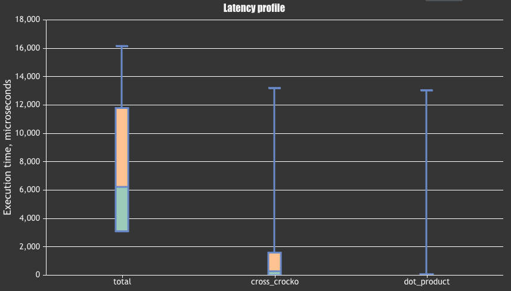
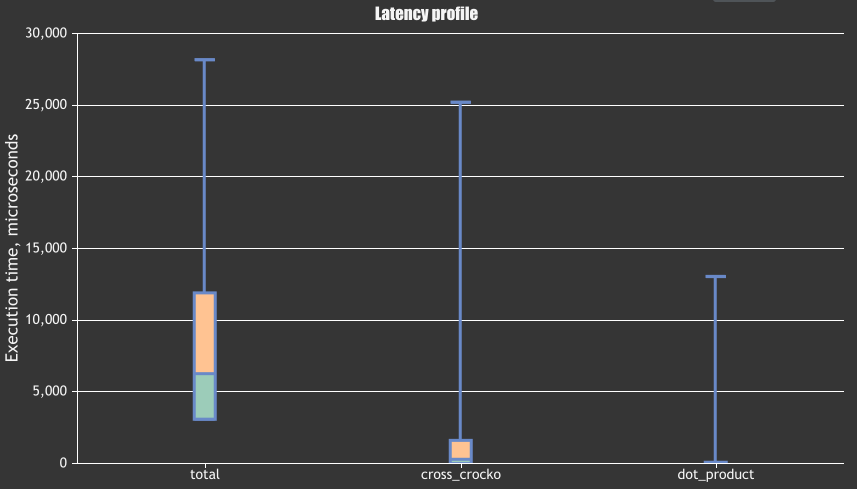

# Dokumentation Team 12 
**Valentin Kögel und Florian Kaiser**

## Ansätze und Methoden zur Laufzeitmessung
### Externe Profiling-Tools:

1. **Profiling-Tools von IDEAS oder Programmiersprachen**: `Xcode Instruments` oder `Clion Profiler`
2. **Webbrowser-Entwicklertools**: `Perfbench.com` oder `quick-bench.com`

### Interne Zeitmessungstechniken:

1. **Manuelle Zeitmessung**: Mit `ctime` kann die aktuelle Systemzeit abgefragt werden.

2. **Benchmarking-Frameworks**: Die std library `Chrono` bietet methoden zur internen Laufzeitmessung.

## Laufzeitmessung des Programms

### Optimierungen

Optimiert wurden die zwei Hauptmethoden des `Async CMDA`, `dot_product(...)` und `cross_correlation(...)`

#### dot_product(...)
Hier wurde die Sequence beim Einlesen zweimal hintereinander gehängt. Dadurch ersparen wir uns den Aufwand für eine Modulo Operation

```cpp
// Vorher
sum += sequence[(i + offset) % 1023] * chip_sequence[i];

// Nachher
sum += sequence[offset + i] * chip_sequence[i];
```

#### cross_correlation(...)
Hier wurde die überprüfung des Skalarprodukts in die Schleife gezogen. 
Dadurch bricht die Schleife bei gefundenem Peak ab und returned einen Wert. Vorher musste die ganze Schleife durchlaufen
werden.

```cpp
// Vorher
int delta_delta = 0;

for(int delta = 0; delta < 1023; delta++) {

    int sum = dot_product(sequence, chip_sequence, delta);
    
    if(sum > pos_peak) {
        pos_peak = sum;
        delta_delta = delta;
        
    }else if(sum < neg_peak) {
        neg_peak = sum;
        delta_delta = delta;
    }
}
if(pos_peak > threshold || neg_peak < -threshold) {
    if(pos_peak > -neg_peak) {
        return make_pair(1, delta_delta);
    }else if(pos_peak < -neg_peak) {
        return make_pair(0, delta_delta);
    }
}

// Nachher

for(int delta = 0; delta < 1023; delta++) {

    int sum = dot_product_optimal(sequence, chip_sequence, delta);

    if(sum > threshold) {
        result[0] = 1;
        result[1] = delta;
        return;
    }else if(sum < -threshold) {
        result[0] = 1;
        result[1] = delta;
        return;
    }
}
```

Außerdem wurden Vektoren und auch Pairs durch Standard-C Arrays ersetzt.

### Interne Laufzeitmessung

#### Aufbau
```cpp
    start_t = clock();
    for(int i = 0; i <24; i++) {
        generate_chip_sequence_stuff(...)
        do_cross_correlation_stuff(...)
    }
    end_t = clock();
    printf("This took %fs\n", ((double) (end_t - start_t)) / CLOCKS_PER_SEC);
```
Die Laufzeit messen wir Intern per zwei Zeitpunkte, ein Startzeitpunkt `start_t` und ein Stopzeitpunkt `stop_t`

Folgende Formel berechnet dann die benötigte Zeit in Sekunden.
```cpp
(end_t - start_t)) / CLOCKS_PER_SEC
```

### Ergebnisse

##### Unoptimiert
```bash
This took 0.079233s
```

**Verbesserung: Vektoren und Pairs durch Arrays ersetzt**

```bash
This took 0.043343s
```
-> Deutliche Verbesserung

**Verbesserung: Modulo in `dot_product(...)` raus optimiert**

```bash
This took 0.031175s
```
-> Deutliche Verbesserung

**Verbesserung: Threshold als int in `cross_correlation(...)`**

```bash
This took 0.029663s
```

**Verbesserung: Threshold als const int in `cross_correlation(...)`**

```bash
This took 0.030760s
```
-> Kaum sichtbare Verbesserung


**Verbesserung: Threshold als magic number in `cross_correlation(...)`**

```bash
This took 0.030116s
```
-> Kaum sichtbare Verbesserung


**Verbesserung: Threshold überprüfung in der Schleife**

```bash
This took 0.025148s
```
-> Deutliche Verbesserung

**Verbesserung: Range-based Loop in `test()`**

```bash
This took 0.025361s
```
-> Keine sichtbare Verbesserung


### Perfbench Laufzeitmessung

### Ergebnisse

#### Unoptimiert
```bash
ID                Calls        Min        Avg        Max      StDev
total                43    60.28ms    68.45ms    73.30ms     6.36ms 
cross_crocko       1045     1.42ms     2.85ms    14.43ms     4.06ms 
dot_product     1069663      1.320      2.663    13.00ms    131.243 
```



#### Optimiert
```bash
ID                Calls        Min        Avg        Max      StDev
total               479     3.10ms     6.23ms    28.13ms     5.62ms 
cross_crocko      11514      3.198    259.397    25.16ms     1.31ms 
dot_product    10377534      0.081      0.174    13.00ms     32.540 
```

 


